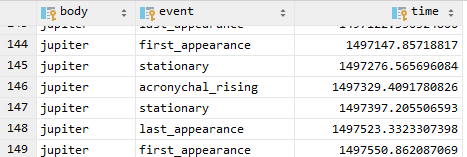

User Guide
==========

Overview
--------

The majority of texts supported by this program have already been dated
by AJ Sachs and H Hunger in the *Astronomical Diaries and Related Texts
From Babylonia* (ADT) series. How did they do it?

> DATING THE DIARIES   Very few diaries have been preserved intact.
> When the statement of date is broken away, how does one proceed in an
> effort to establish the date?   A dense network of positions for
> the planets, sun, and moon during the last six centuries B.C. is
> available in Tuckerman. Using the tables of C. Schoch and P.V.
> Neugebauer, A. Sachs computed for the period from -450 to -10 the
> planetary phenomena which the Babylonians considered significant: last
> appearance, first appearance, stationary points and (for outer
> planets) acronychal rising. Tables for lunar and solar eclipses exist;
> I mention P. V. Neugebauer, Spezieller Kanon der Mondfinsternisse ….,
> Astronomische Abhandlungen 9/2 (1934) and Spezieller Kanon der
> Sonnenfinsternisse …., Astronomische Abhandlungen 8/4 (1931), and the
> recent work by H. Mucke and J. Meeus, Canon of Solar Eclipses, and
> Canon of Lunar Eclipses (Vienna 1983). For the last several centuries
> B.C., the Babylonian scheme for the dates of solstices, equinoxes, and
> Sirius phenomena is known and can help to determine the date of a
> diary.   It is, of course, trivial that the mention of a king
> Arsaces means that there is no need to look for a date before SE 170.
> The occurrence of the city Seleucia makes only dates beginning with
> the 3rd century B.C. possible. Less trivial criteria, like changes in
> orthographic conventions, emerge after one arranges the already dated
> texts in their chronological sequence. \[1, p. 19\]

The *astro-tablets* program takes a similar approach of testing the
diaries against tables of relevant astronomical data, however it has the
aim of being less reliant on external chronological information and
assumptions. To do, so it works by testing a text against astronomical
tables for a given base year completely automatically, and then
repeating this in a brute force fashion across a large range of possible
years.

Running *astro-tablets* requires two stages, in the first stage
`generate`, a database is created containing all the necessary
astronomical data for the observations in a text, using the
[Skyfield](https://rhodesmill.org/skyfield/) astronomy library. In the
second stage `query`, that database is then repeatedly queried with
different base years, and a total score is computed, allowing the base
years to be ranked for the best match.

Installation
------------

### Using Docker

    git clone https://github.com/jacob-pro/astro-tablets.git
    cd astro-tablets
    docker build -t astro-tablets .
    docker run --rm -it -v ${PWD}/generated:/astro-tablets/generated -v ${PWD}/skyfield-data:/astro-tablets/skyfield-data \
    astro-tablets *SUBCOMMAND* *ARGS*

### Manually

1.  Requires Python 3.7
2.  Install `requirements.txt` using Pip
3.  If using an IDE like PyCharm define `./src` as a source folder in
    project structure
4.  Run `python ./src/cli.py *SUBCOMMAND* *ARGS*`

The Generate Stage
------------------

To create the database for a given tablet use the `generate` subcommand:

    usage: cli.py generate [-h] [--db DB] [--overwrite] [--start START]
                            [--end END]
                            tablet

    positional arguments:
      tablet         name of the tablet to generate ephemeris for

    optional arguments:
      -h, --help     show this help message and exit
      --db DB        override path to save the database to
      --overwrite    overwrite the database if exists
      --start START  override start year
      --end END      override end year

Valid tablets include:
`{bm32312, bm41222, bm76738, bm35115, bm32234, bm38462, vat4956, bm33066}`.

By default, the database will be saved to `./generated/TABLET_NAME.db`.
If the file already exists it will prompt before overwriting, unless the
`--overwrite` option is set.

Each tablet has a default start and end year associated with it, roughly
100 years around its expected dating, this can be overridden with the
`--start` and `--end` flags.

The generate stage can take a very long time (e.g. 10 hours) and
generate a large database file (e.g. 300MB), depending on the complexity
of the tablet, and the number of years being generated.

The generated database is in *SQLite* format and stores tables with all
the necessary event times and ephemeris, for example:

The Query Stage
---------------

Once a database has been generated for a tablet, then the `query`
subcommands may be run:

    usage: cli.py query [-h] [--db DB] [--year YEAR] [--slim] tablet [subquery]

    positional arguments:
      tablet       name of the tablet to query ephemeris for
      subquery     optional subquery

    optional arguments:
      -h, --help   show this help message and exit
      --db DB      override path to source database
      --year YEAR  optionally output a specific year
      --slim       only output best compatible path

The tablet names are the same as in the generate stage, by default it
will look for the database at `./generated/TABLET_NAME.db` (although
this can be overriden with the `--db` flag). Some tablets support an
optional subquery that applies a filter to which observations are
queried, check the source in `./src/query/TABLET_NAME.py` to see which
of these are available.

The query will run for all of the years that the database file contains,
and then output the results to the console, in descending order of best
match.

To get a report for a specific base year add the `--year` flag, it will
be saved as a JSON file in the working directory, containing all the
details of the matched observations. By default, it will show all the
possible year start dates (a year can in theory begin at any of the
first lunar visibilities ±30 days from the vernal equinox, meaning there
are about 2-3 possibilities). However if the intercalary month
information is known then their compatibility (as in building a valid
sequence of years) can be assessed. The compatible sequence of years
with the highest score (as used in the main result) will be flagged with
`best_compatible_path`, to show only these results in the JSON use the
`--slim` flag.

Other Commands
--------------

To generate the graphs found in `./documents/graphics` use this command:

    cli.py graphs

Testing
-------

    make test

The unit tests check that the astronomical computation functions (used
primarily in the generate stage) are working correctly, by comparing the
results with data from other sources (commercial software, and academic
publications).

References
----------

\[1\] H. Hunger and A. J. Sachs, *Astronomical diaries and related texts
from Babylonia. Vol. 1, Diaries from 652 B.C. to 262 B.C. : Plates*.
Verlag der Österreichischen Akademie der Wissenschaften, 1988.
